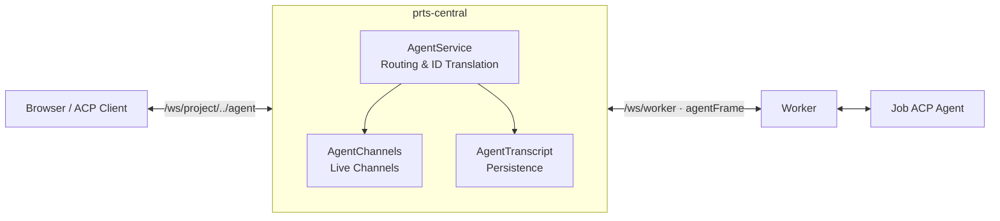

# ACP Agent Sessions

`io.ib67.prts.agent.acp` proxies the [Agent Client Protocol](https://agentclientprotocol.com) between a job's agent and connected viewers, persisting all exchanged frames.

Agent traffic multiplexes over the workerEntity WebSocket connection. Viewers communicate with central over standard JSON-RPC.

## Method Routing

`AcpMethod` maintains an allowlist of supported methods. Unrecognized or misdirected methods are rejected with JSON-RPC error `-32601`.

| Route | Methods | Description |
| --- | --- | --- |
| `LOCAL` | `initialize` | Answered locally from workerEntity's `AgentAttached` snapshot. |
| `TO_AGENT` | `session/prompt`, `session/cancel`, `session/set_mode`, `session/set_config_option` | Viewer to agent. Requires `job:agent:interact`. |
| `TO_CLIENT` | `session/update`, `session/request_permission`, `elicitation/create`, `elicitation/complete` | Agent broadcast to all viewers. |

Restricted methods:
- `session/new`, `session/load`, `session/resume`, `session/close`, `session/delete`: Managed internally by job lifecycle. Historical events are queried via `GET .../agent/session/{id}/event`.
- `fs/*`, `terminal/*`: Container-local operations handled directly by workers; central rejects them if forwarded.
- `$/cancel_request`: Not currently relayed (see [TODO.md](../TODO.md)).

Central augments the cached `initialize` snapshot with `result._meta.prts` (job ID, project ID, root session ID, and known sessions).

## ID Translation

Request IDs are scoped per-connection while multiple viewers share one workerEntity link:
- **Viewer to Agent**: `AgentChannel` renumbers the request upstream and maps it back to the originating viewer when answered.
- **Agent to Viewer**: Broadcast under a renumbered ID. The first viewer response claims the request; subsequent responses are dropped.
- **Undeliverable requests**: Agent requests with no connected viewers fail immediately.

## Sessions and Subagents

Attaching registers an initial root session. Subsequent agent-emitted session IDs are treated as subagent sessions parented to root. Total sessions per job are capped by `acp.max-sessions-per-job`.

## Transcript Persistence

- Frames are persisted to `agent_event` sequentially before forwarding.
- Recorded payloads reflect the wire format at the agent boundary, including translated IDs and sender `actor` IDs.
- Refused frames and local `initialize` calls are not persisted.

## Lifecycle & Close Codes

| Event | Action |
| --- | --- |
| `AgentAttached` | Validates job state and workerEntity ownership, opens root session, replaces previous channel if reattached. |
| `AgentDetached` | Closes sessions and viewers. |
| Worker disconnect | `AgentService.onWorkerGone` drops channels and closes viewer sockets before jobs transition to failed. |
| Job terminal | `onJobClosed` runs post-commit to close viewer sockets outside the transaction. |

WebSocket close codes:
- `4403`: Forbidden (insufficient permissions).
- `4404`: No active agent session.
- `4429`: Viewer limit exceeded (`acp.max-viewers-per-job`).
- `1000`: Normal closure.

## Authorization

Enforced programmatically in `AgentWebSocket` via `JobAccess`:
- `job:agent:read` (`VIEWER`): Required to attach and query REST history.
- `job:agent:interact` (`MEMBER`): Required to prompt, cancel, or answer agent requests (requires unarchived project).
