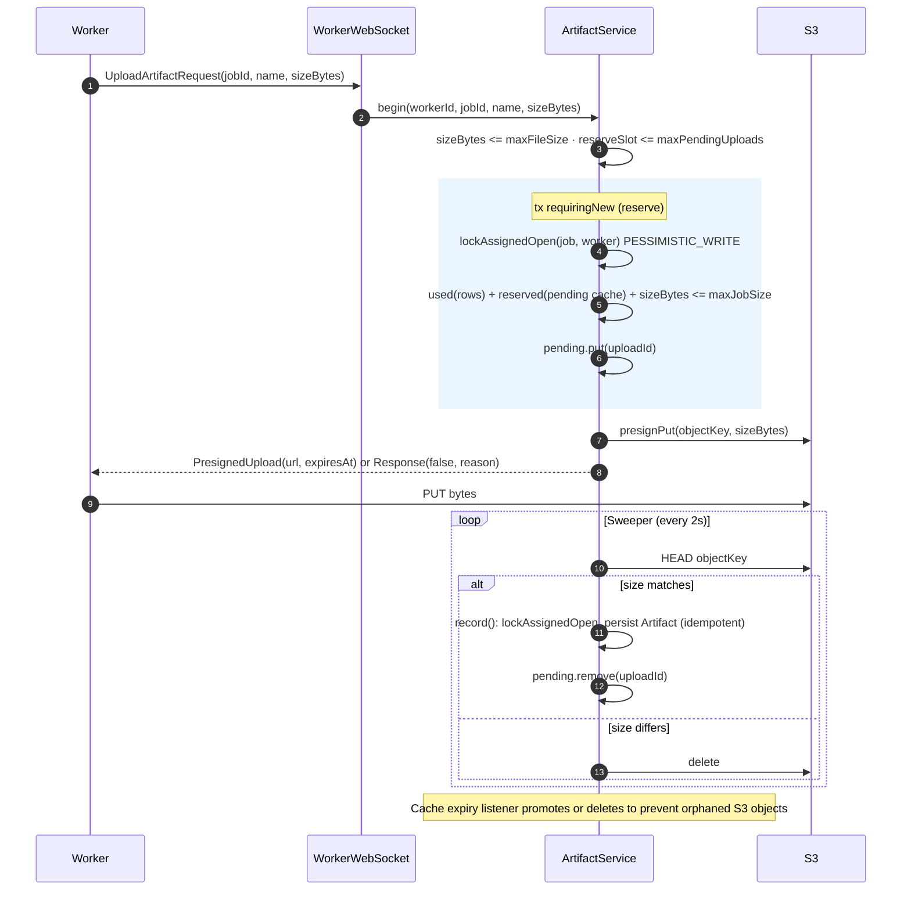

# Artifact Upload Flow

Artifact uploads bypass the central API and transfer directly from workers to S3 via presigned URLs.

## Upload Lifecycle

## Deletion

`ArtifactService.delete(projectId, artifactId)` (invoked via `DELETE /project/{projectId}/job/artifact/{id}`, requiring `job:artifact:delete`) deletes the database row in a new transaction (`requiringNew()`) and then deletes the S3 object outside the transaction.

This order prevents handing out presigned URLs for already deleted S3 objects if the database commit fails. Any orphaned S3 object left by a failed storage deletion remains inaccessible through the API.

## Storage Limits (`StorageConfig`)

| Config Property | Scope | Description |
| --- | --- | --- |
| `max-file-size` | Per file | Max bytes per artifact file. |
| `max-job-size` | Per job | Max aggregate bytes across all artifacts of a job. |
| `max-job-artifacts` | Per job | Max count of artifacts for a single job. |
| `max-pending-uploads`| Global | Max in-flight uploads service-wide (`reserveSlot`, outside transactions). |

## In-Flight Reservation & Quota Accounting

- **Quota Calculation**: `persisted artifact bytes + currently reserved pending bytes`.
- **Concurrency Control**: Quota check and cache reservation run under `PESSIMISTIC_WRITE` on the `job` row (`reserve()`) inside `ArtifactService`.
- **Worker Verification**: `lockAssignedOpen` verifies that the reporting worker matches `job.worker` and that the job is currently open (`PENDING` or `RUNNING`).
- **Cache & Sweeper**:
  - In-flight uploads are tracked in a Caffeine cache with TTL `presign-duration + 5m`.
  - A periodic sweeper checks pending objects via `HEAD` every 2 seconds. Matching sizes are persisted to `artifact` rows; mismatched sizes are deleted from S3.
  - The cache removal listener performs a final promote-or-delete upon TTL expiration to prevent orphaned S3 objects.
  - A concurrent `promoting` set prevents race conditions between the sweeper and the cache removal listener.

