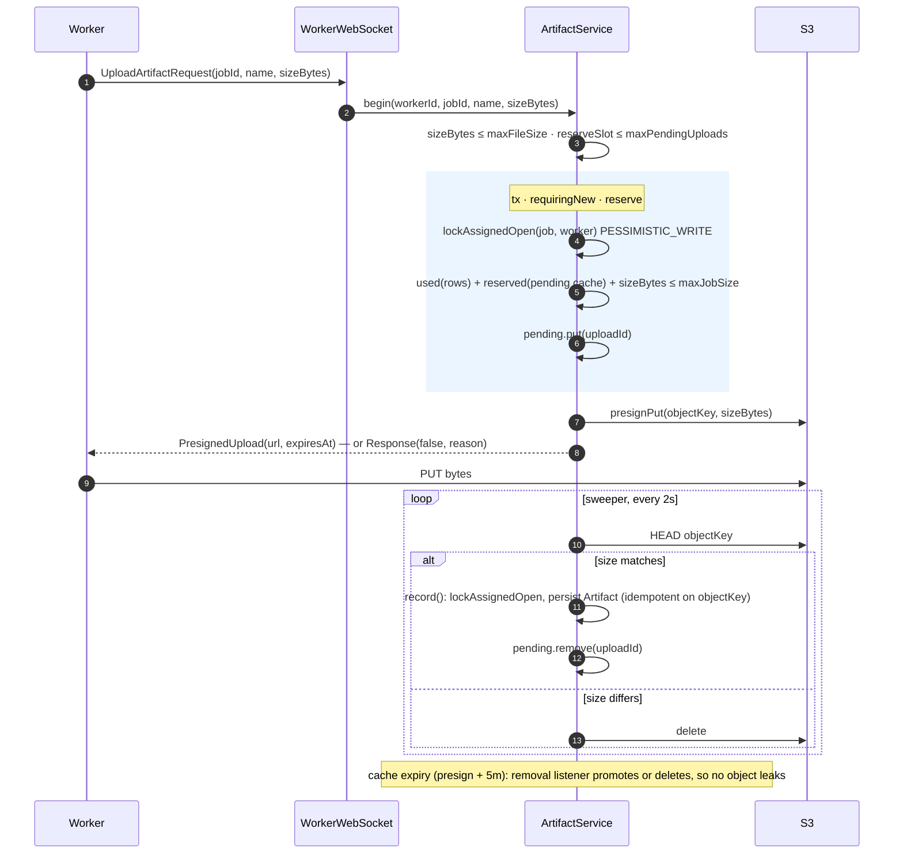

# Artifact upload flow

Uploads never pass through this service:

1. Worker sends `UploadArtifactRequest`.
2. `ArtifactService.begin` (in `storage`) checks the limits, reserves a slot and an in-memory quota entry, then
   returns a presigned `PUT` (`ClientboundMessage.PresignedUpload`). The quota check and the
   reservation happen under a `PESSIMISTIC_WRITE` on the job row (`reserve`), which is why the DB half
   and the cache half of the quota live in one bean.
3. Worker `PUT`s directly to S3.
4. A 2s sweeper `HEAD`s each pending key; on a size match it promotes the upload to an `Artifact`
   row, on a mismatch it deletes the object.

Four limits, on `StorageConfig`, and they are not the same shape: `maxFileSize` and `maxJobSize` bound
bytes, `maxJobArtifacts` bounds the count **per job**, and `maxPendingUploads` bounds concurrent
in-flight uploads **across the whole service** (`reserveSlot`, outside any transaction). Only
`max-file-size` / `max-job-size` are set in `application.yml`; the other two run on their defaults.

Pending uploads live in a Caffeine cache with TTL `storage.presign-duration + 5m`; the removal
listener does a final promote-or-delete so an expired entry never leaks an S3 object. Quota is
computed as *persisted artifact bytes + still-reserved pending bytes*.

The quota spans persisted rows *and* in-flight reservations, which is why both halves live in one
bean and are checked under the job row lock: two concurrent uploads cannot both fit into the same
remaining room. Only the worker the job was assigned to may attach to it, and only while it is open —
`lockAssignedOpen` is the one place the worker protocol checks that a message names a job that worker
was actually given. A `promoting` set keeps the sweeper and the removal listener off the same upload.
