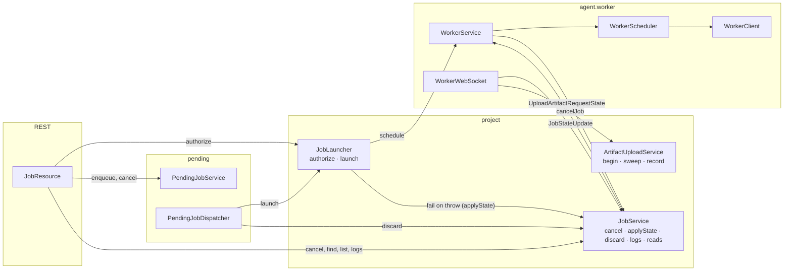
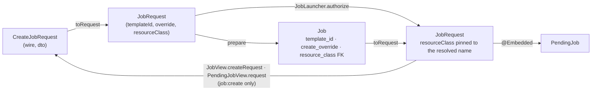
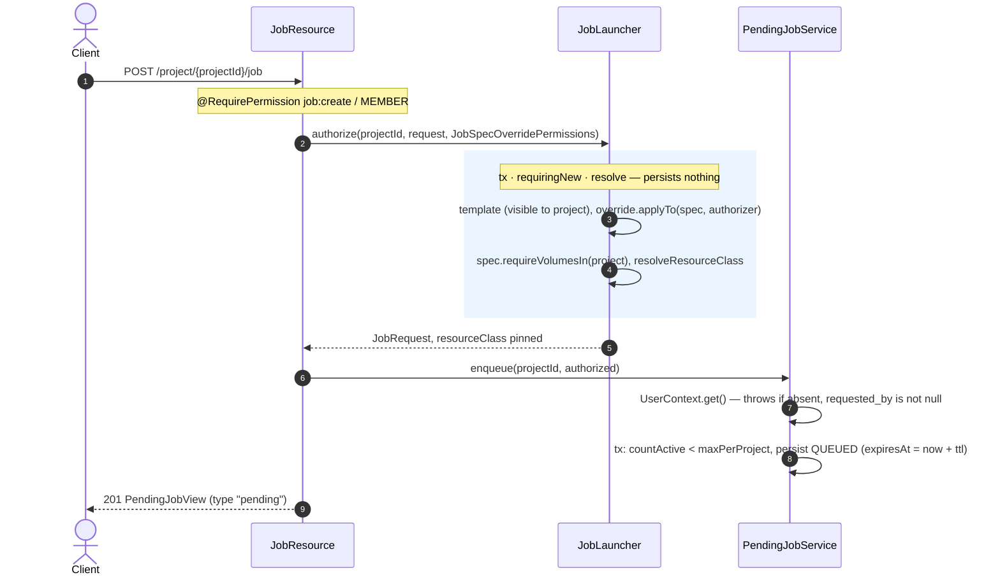
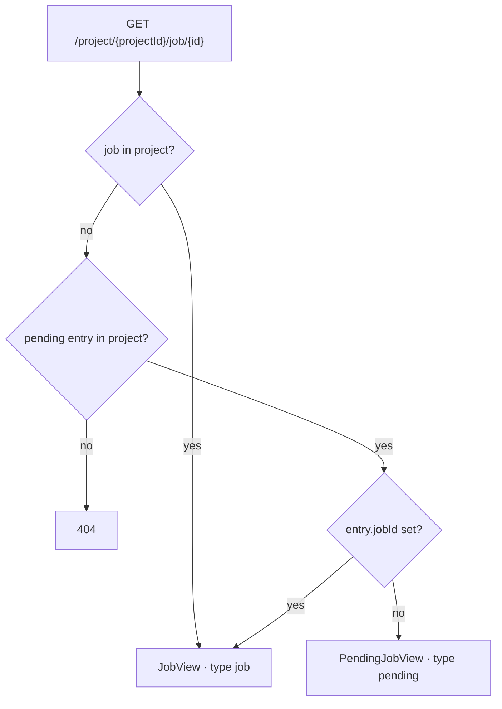
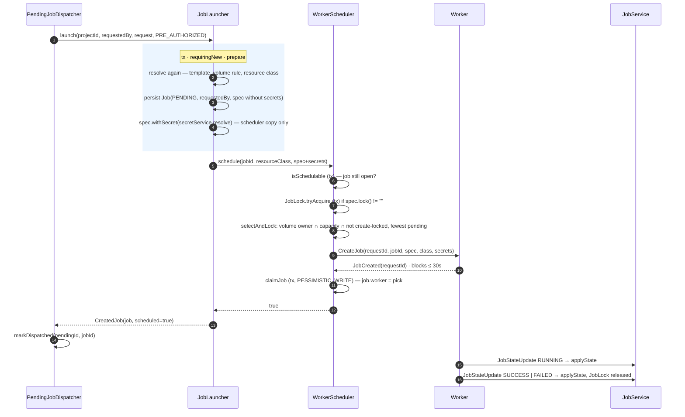
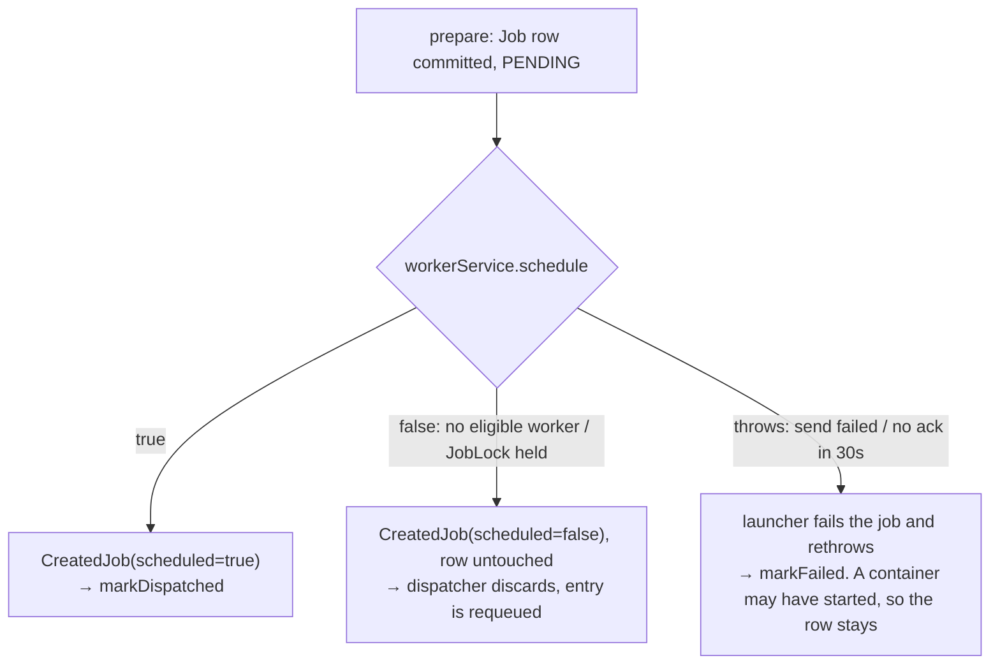
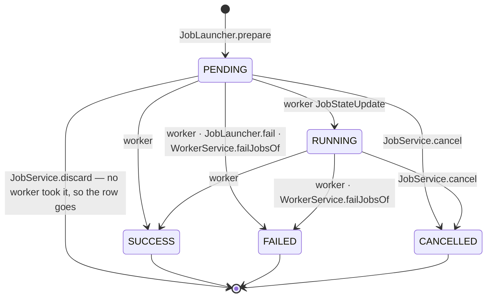
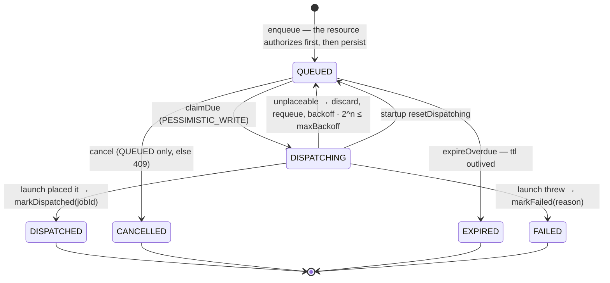
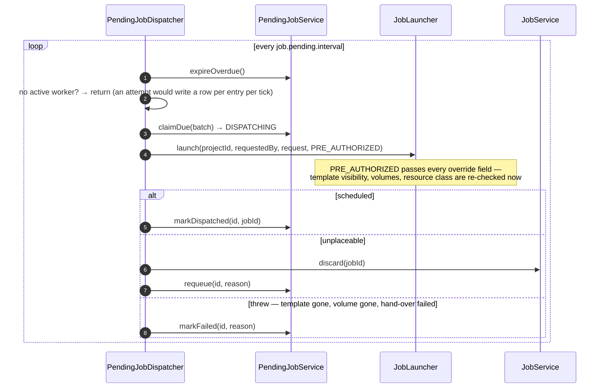

# Job lifecycle

How a create request becomes a running `Job`, who moves it through its states, and what is undone
when a step fails.

## Who owns what

Three beans in `project`, split by what they own:

| Bean | Owns | Never does |
| --- | --- | --- |
| `JobLauncher` | making a job: merge template + override, gate the spec, persist, hand to the scheduler | decide what an unplaceable job leaves behind, or move a job's state except through `JobService` |
| `JobService` | every way a job ends (`cancel`, `applyState`, `discard`) and every `JobLock` release, logs, project-scoped reads | create or schedule |
| `ArtifactUploadService` | the artifact quota and the S3 hand-off | anything about the job's state |

Every `JobLock` release is on that middle bean, `discard` included — it takes a job id, not a request,
and undoing a create is not the same job as making one.

The pending queue sits *above* the launcher as an ordinary client, and the scheduler sits *below*
it with no queue of its own: it places a job or says why it could not.

Neither *who is asked* nor *what a refusal leaves* is the launcher's: the `JobSpecOverrideAuthorizer`
is a **parameter** of `authorize`/`launch`, and an unplaceable job is reported (`scheduled=false`) with
the row left `PENDING` for the caller to hand to `JobService.discard`. `PendingJobDispatcher` is the
only caller of `launch`, so it owns both. Only a throw is compensated inside `dispatch`
(`applyState(FAILED)`), because the caller cannot — the job id is not on the exception, and the offer
may already have started a container.

## The request

`JobRequest` is the one domain value the launcher takes: `(templateId, override, resourceClass)`.
`Job` stores its parts (the resource class as the resolved FK), `PendingJob` embeds it whole;
`CreateJobRequest` is only its wire shape, converted at the resource. Both hand back a request whose
`resourceClass` is the **resolved** name, so a replay or re-run runs under the class that was
authorized even if the template has since moved on — and asking for the template's own class is not
an override, so it costs no `job:resource-class` permission.

`launch(projectId, requestedBy, request, authorizer)` takes the requester as a separate argument, and
`prepare` writes it to `job.requested_by`. Deliberately *not* on the `JobRequest`: the request is what a
client posts back to re-run, so a requester living there would be a requester the client could forge.
The dispatcher thread has no `UserContext`, so this is the only way the information survives — nothing
recovers it later, since the queue entry that held it expires.

## Create

There is no synchronous create, and no endpoint that bypasses the queue. The answer is the entry;
the job appears on it as `jobId` once `PendingJobDispatcher` places it, within
`job.pending.interval` of the enqueue.

`requested_by` is captured here and nowhere else: the dispatcher runs on a thread with no
`UserContext`, so each attempt carries the entry's value into `launch`, which writes it onto the
`Job`.

Every override field the caller supplied goes through its own `@RequirePermission` method on
`JobSpecOverridePermissions`, which reads the project off the request path — which is why
authorizing happens in the resource and not on the dispatcher's thread, where there is no request
to read it off. See [job-spec.md](job-spec.md) for the gating idiom.

## Reading it back

The client keeps the one id it got from the `POST`. `GET .../job/{id}` accepts either kind and
follows the entry to its job:

`type` tells the two apart, and it never flips back: a discarded attempt leaves `jobId` unset, so an
entry reads as `pending` until an attempt actually places it. Both views carry the stored
`CreateJobRequest` only for a caller holding `job:create` — `JobAccess` answers that for both
resources — since seeing the request a re-run would post costs what posting one costs.

`POST .../job/{id}/cancel` walks the same tree: a job is cancelled as a job, an entry with `jobId` set
is cancelled as the job it became, and an unplaced entry is cancelled as an entry (`QUEUED` only). The
answer is whichever it cancelled, `type` telling which.

`GET .../job` lists both kinds together, newest first: jobs through `Job.listVisibleByProject`, which
hides the orphan `PENDING`-with-no-worker rows of `TODO.md`, and entries with no `jobId` yet — an entry
that has one is already on the list as its job.

## Dispatch

What `JobLauncher.launch` does with the request when the dispatcher hands it back.

Only the per-field override rules are taken as settled here — `PRE_AUTHORIZED` passes every field —
and the dispatcher is where that is vouched for. The RPC is why nothing runs inside one
transaction: `prepare` commits first, the scheduler opens short transactions of its own around the
lock and the claim, and the create ack is awaited on a bare thread.

### What a refusal leaves behind

The launcher decides only the throw branch, and only because the caller cannot: the job id is not
on the exception. The `scheduled == false` branch is a policy — keep the row or drop it — so it
belongs to whoever asked. A crash between the two commits leaves a row nobody collects; see
`TODO.md`.

`JobService.discard` will not take the caller's word for it. It deletes only a job that is `PENDING`
**and** has no worker, throwing otherwise — the two are not the same thing, because `claimJob` sets
`worker` at hand-over while the state waits on the worker's own report. Deleting a job with a worker
would strand its container, drop the row its `JobStateUpdate`s land on, and free the lock for a job
to run beside it. A job already deleted is a no-op, so retrying is safe.

Inside the scheduler a thrown RPC also sends `CancelJob` to the picked worker *before* the lock is
released, so a container that did start does not run on past a lock a retry is about to take.
`claimJob` returning `false` — the job was cancelled while the worker was starting it — is the same
story: `CancelJob`, then `null` ("nothing more is needed").

## `JobState`

Every transition funnels into two methods, both under `PESSIMISTIC_WRITE` because the guard is a
check-then-write (`discard` is the third `PESSIMISTIC_WRITE` writer, and the only exit that is not a
transition):

- `JobService.applyState(jobId, state)` — the worker's reports, the launcher's `fail`, and
  `failJobsOf` when a worker disconnects. Ignores a job that is already terminal and a no-op
  transition; it checks **terminality, not order** (a `RUNNING → PENDING` report would be applied).
- `JobService.cancel` — `prepareCancel` in a transaction (409 if terminal, `transitionTo(CANCELLED)`,
  release the lock, log), then `CancelJob` to the worker with no ack expected, then a best-effort
  log line of whether the worker was reachable.

Invariants worth knowing:

- **The server is authoritative.** `applyState` ignores worker reports once the job is terminal.
  `Job` is `@DynamicUpdate` so two writers cannot revert each other's columns.
- A disconnecting worker has its open jobs failed (`WorkerService.failJobsOf`) — nobody would report on
  them, and a non-terminal job holds its `JobLock` forever. Registration is last-writer-wins, and only
  the connection owning a session may end it.
- Always use `Job#transitionTo`, never `setState` — it keeps `completedAt` consistent with the
  `job_completion_consistency` DB check constraint (set on terminal states, cleared otherwise).

### `JobLock`

Per-project mutual exclusion for specs whose `lock` is non-empty. Held from hand-over to terminal,
taken over only from a terminal holder.

| Event | Effect | Code |
| --- | --- | --- |
| dispatch, before a worker is picked | acquire; a live holder means "refused", not "wait" | `WorkerScheduler.schedule0` → `JobLock.tryAcquire` |
| holder is terminal or gone | taken over — a crash between dispatch and completion cannot orphan it | `JobLock.tryAcquire` |
| not dispatched, whatever the reason | release | `schedule0` `finally` |
| terminal via `applyState` | release | `JobService.applyState` |
| cancel | release | `JobService.prepareCancel` |
| unplaceable, so discarded | release, then delete the row | `JobService.discard` |
| worker disconnects | its open jobs are failed, which releases | `WorkerService.failJobsOf` |

`JobSpec.timeout` is **not enforced anywhere yet**, so a hung job holds its lock until someone cancels
it or its worker drops.

## Pending queue

`io.ib67.prts.pending` is the queue, and it sits *above* `JobLauncher` rather than inside the
scheduler: `PendingJobDispatcher` is a client of the ordinary create path.

Entries are made by the *Create* flow above; this is what drains them.

Two things make this sound:

- **Authorization is frozen at enqueue.** The requester exists only in the create request, so
  `JobResource` runs the real per-field gates there (`JobLauncher.authorize` with
  `JobSpecOverridePermissions`) and hands `PendingJobService` a request already cleared; the dispatcher
  launches with `PRE_AUTHORIZED`, a public pass-through `JobSpecOverrideAuthorizer` on the launcher. A
  revoke after enqueue does not reach a queued entry; `job.pending.ttl` bounds how long that lasts.
  Neither `enqueue` nor `launch` can tell an authorized request from any other once it has been stored
  and read back — the caller vouches, and each has exactly one caller.
- **No `Job` exists while an entry is queued.** The row stores the request — an `@Embedded JobRequest`
  over `template_id`, `create_override`, `resource_class` — never a merged `JobSpec`, which is why no
  secret can land in it: each attempt goes through `JobLauncher.prepare`, which resolves the project's
  secrets afresh. An unplaceable attempt deletes the job it just persisted. Hence `JobService.cancel`
  and `failJobsOf` know nothing about the queue, and cancelling an entry is only possible in `QUEUED`:
  once `DISPATCHING`, the job it produces is cancellable on its own.

`requested_by` is **not null** on both `pending_job` and `job`, and the entry's value is what the
attempt hands to `launch`. `enqueue` throws `IllegalStateException` when the context has no user
rather than storing a blank — unreachable from the one caller today (`@RequirePermission` already
refuses an identity with no local user), and there so the first path that queues without a requester
fails at the seam instead of quietly writing an entry nobody is holding.

`QUEUED → DISPATCHING` is claimed under `PESSIMISTIC_WRITE` before the attempt, so cancelling
(`QUEUED` only) cannot race one in flight. A leftover `DISPATCHING` is requeued at startup.
