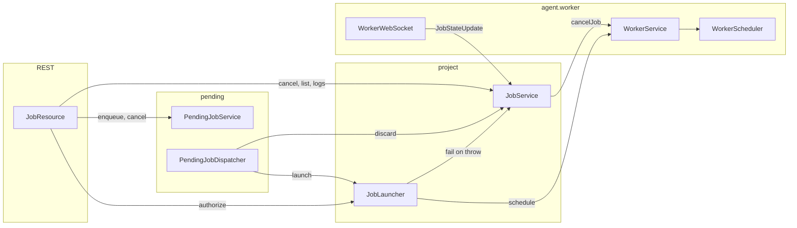
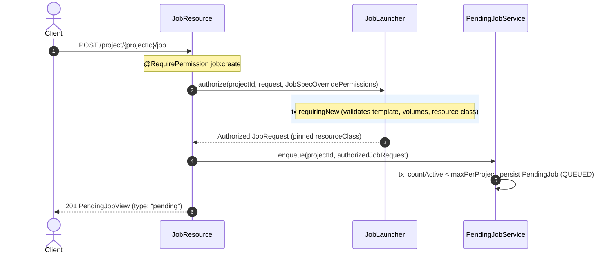
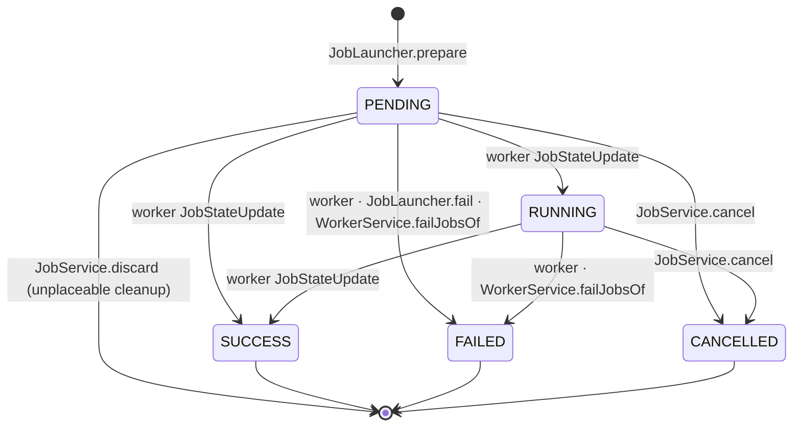

# Job Lifecycle & Execution Architecture

Describes how a job request moves from creation through the pending queue to execution and termination.

## Component Ownership

| Component | Responsibilities | Excluded Operations |
| --- | --- | --- |
| `JobLauncher` | Merge template + task scope + override, validate spec & volumes, persist `Job`, pass to scheduler. | Terminal state handling, queue decisions, unplaceable cleanup. |
| `JobService` | Terminal state transitions (`applyState`, `cancel`), cleanups (`discard`), `JobLock` release, logs, `stopOpen`. | Job creation, worker scheduling. |
| `PendingJobService` | Queue persistence, active queue counting, status transitions. | Dispatch execution logic. |
| `PendingJobDispatcher` | Periodic polling, worker eligibility check, batch claiming, dispatch & retry orchestration. | Direct entity persistence. |
| `WorkerScheduler` | Worker selection, capacity checks, volume affinity, `JobLock` acquisition. | Queueing, HTTP error handling. |

## Job Request & Create Flow

- **Asynchronous Enqueue**: `POST .../job` never creates an active job synchronously; it persists a `PendingJob` and returns `201 Created` with `PendingJobView`.
- **Request Immutability**: `JobRequest` embeds `templateId`, `create_override`, the resolved `resourceClass`, and an optional `taskId`. Secrets are not stored in queue rows.
- **Requester Identity**: `requested_by` is stored explicitly on `PendingJob` and carried to `Job`.
- **Task Scope**: a request naming a task is merged against it in `JobLauncher.resolve` — which runs at
  enqueue *and* on every dispatch attempt, so the task is re-read each time. A task that closed in
  between conflicts, and the dispatcher fails the entry as it does for a deleted template. `taskId`
  carries no foreign key, for the same reason `templateId` does not. See [task-scope.md](task-scope.md).

## Dispatch Flow (`PendingJobDispatcher`)

Runs every `job.pending.interval`:
1. **Expiry**: Marks overdue entries as `EXPIRED` (`expireOverdue`).
2. **Worker Check**: Idles immediately if no active worker is registered.
3. **Claiming**: Claims a batch of due entries under `PESSIMISTIC_WRITE` (`QUEUED` -> `DISPATCHING`).
4. **Launch**: Calls `JobLauncher.launch(projectId, requestedBy, request, PRE_AUTHORIZED)`:
   - `prepare()`: Persists a `PENDING` `Job` entity, resolves project secrets onto an in-memory scheduler copy of `JobSpec`.
   - `WorkerScheduler.schedule()`: Acquires `JobLock`, verifies volume affinity and worker capacity, and calls worker RPC `CreateJob`.
5. **Outcome Handling**:
   - **Scheduled**: Marks entry `DISPATCHED` with assigned `jobId`.
   - **Unplaceable** (`scheduled = false`): Calls `JobService.discard(jobId)` to delete the transient `PENDING` job row; calls `requeue()` with exponential backoff.
   - **Failure / Exception**: Calls `markFailed(reason)`. If an exception occurred during scheduling, launcher transitions the job to `FAILED` (`applyState`) to prevent dangling containers.

## Job State Machine (`JobState`)

### Invariants & State Transition Rules
- **Authoritative Transitions**: All state changes must go through `Job#transitionTo`, ensuring `completedAt` remains synchronized with the DB check constraint `job_completion_consistency`.
- **Concurrency**: `JobService.applyState` and `JobService.cancel` acquire `PESSIMISTIC_WRITE` locks on the `job` row.
- **Terminal Lock-in**: Once terminal (`SUCCESS`, `FAILED`, `CANCELLED`), subsequent worker reports are ignored.
- **Worker Disconnect**: When a worker disconnects, `WorkerService.failJobsOf` transitions all open jobs on that worker to `FAILED`.
- **`JobService.discard`**: Deletes a `PENDING` job only if `job.worker` is null. Throws `IllegalStateException` if a worker was already assigned.

## Mutual Exclusion (`JobLock`)

Specs specifying a non-empty `lock` enforce per-project mutual exclusion:
- **Acquisition**: `JobLock.tryAcquire` is called by `WorkerScheduler` before worker dispatch. If held by a non-terminal job, acquisition fails and the job is marked unplaceable.
- **Takeover**: If the current lock holder is already terminal or missing, the lock is reassigned to the new job.
- **Release**: Automatically released when the holding job reaches a terminal state (`applyState`, `cancel`), when unplaceable (`discard`), or upon worker disconnect.

