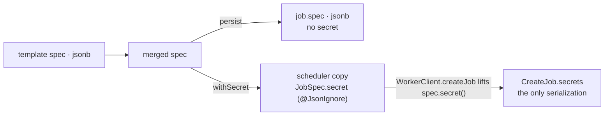

# `JobSpec`, templates, resource classes

## Secrets never touch the row

`JobSpec` is jsonb on the template and the job, and travels to the worker. Its one field that is
**not** part of that is `secret`, the project's secrets in the clear, to be injected at dispatch time:

`@JsonIgnore` keeps it out of the jsonb column *and* out of every serialization of a spec, the one the
worker receives included. So the secrets reach the worker beside the spec instead — `CreateJob` has a
`secrets` field of its own and `WorkerClient.createJob` lifts `spec.secret()` onto it by hand, which
makes that message the only place a secret is ever serialized. What fills the field is
`JobLauncher.prepare`, and only on the copy it hands the scheduler: the `Job` it persists keeps the
secret-free spec, so a plaintext value exists no longer than the dispatch, and neither the row nor
anything read back off it could hold one even without the `@JsonIgnore`. `JobSpec.withSecret` is the
only way in, and `JobSpec.toString` is hand-written to print a count instead of the values.
Every view of a spec goes through `JobView.SpecView`, including `JobSpecTemplateView`, so a new
`JobSpec` field is not published by default.

## Nullability

Nothing on a `JobSpec` is nullable: its compact constructor normalizes an absent container to the
empty one and an absent or blank `lock` to `""`, which is what a spec read back off an older jsonb row
or built from a template with a null column goes through. Add a field and normalize it there too.

## Templates

A `JobSpecTemplate` belongs to a project, or to none: a null `project_id` is a **global template**
every project may use. `listVisibleFetched` / `findVisibleFetched` are the only finders, and
`JobLauncher.prepare` goes through them — a template of another project is a 404, so a spec
cannot be reached across projects.

## Resource classes

A `ResourceClass` is scoped the same way, but its key **is** `(name, project_id)` — the name is only
unique within a project, so two projects may each mean their own thing by `large`. Postgres cannot key
on null, so "global" is the reserved `ResourceClass.GLOBAL` (the `Permission.GLOBAL` trick again, and
the same `Reserved.ID` — see [authorization.md](authorization.md)) and `null` is normalized to it by
`scopeOf`. `findVisible(projectId, name)` returns the project's own row or, failing that, the global
one — **a project row shadows a global row of the same name**. Every reference is therefore a
two-column FK (`resource_class`, `resource_class_project`) on `job` and `job_spec_template`. The entity
is `@IdClass`, not `@EmbeddedId`, so `getName()` and the JSON the worker receives are unchanged;
`projectId` is `@JsonIgnore`d because no worker needs it. `JobLauncher.resolveResourceClass` gates the
request against `job:resource-class` only when it **deviates** from the template's class — asking for
what the template already says is not an override, and a re-run must not cost more permission than the
create it replays.

## Volumes

A spec may only mount volumes of **its own project** (`JobSpec.requireVolumesIn`) — membership in the
volume's project is not enough, since the job's logs and artifacts are readable by every viewer of the
project it runs in.

## The per-field override gating idiom

`JobSpecOverridePermissions` is a bean of one pass-through method per `JobSpec` field, each annotated
with its own `@RequirePermission` but taking no project argument — the check picks the project off the
request path. `JobSpecOverride.applyTo` calls the method for every field the caller actually supplied,
so the interceptor enforces field-level permissions per project. Scalar fields replace the template
value; `Map`/`List` fields **merge** into it (map entries win per key, list entries are appended), so an
empty container is a no-op and no override can remove a template entry.

`applyTo` takes the gate as a **parameter** typed `JobSpecOverrideAuthorizer`, not as a fixed
dependency, because a create may be authorized in one request and submitted from a thread where the
interceptor could not run — that is the seam the pending queue replays through.

`JobSpecOverridePermissions` may not be renamed off the `Permissions` suffix: `PermissionOASFilter`
finds it by that name.

**To add an overridable spec field: add the field to `JobSpec` and `JobSpecOverride`, a constant to
`Perm`, a method to `JobSpecOverrideAuthorizer` with its gated implementation in
`JobSpecOverridePermissions` (and a pass-through in `JobLauncher.PRE_AUTHORIZED`), and wire it in
`applyTo`.**
