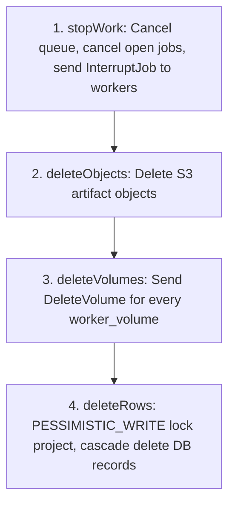

# Project Deletion Architecture

`ProjectService.delete(projectId)` executes outside-in cleanup to ensure external resources (containers, S3 objects) are eliminated before database records:

## Deletion Phases

1. **`stopWork(projectId, reason)`**:
   - Cancels active queue entries (`PendingJob.cancelActive`).
   - Hands the project's open jobs to `JobService.stopOpen`, which marks each `CANCELLED`, dispatches `ClientboundMessage.InterruptJob` to its worker, and purges unassigned pending uploads.
   - *Note*: `InterruptJob` informs the worker that the job no longer exists on the server. Workers must drop the container immediately without reporting terminal state updates.
   - **Also used by `ProjectService.archive`**: Cancels pending work and interrupts active jobs before setting the project to read-only. The `reason` parameter informs the worker whether the interruption was caused by deletion or archiving.
   - `stopOpen` is the reusable half of teardown: task closure calls it with `Job.listOpenByTask` instead. See [task-scope.md](task-scope.md).
2. **`deleteObjects`**:
   - Deletes all S3 objects associated with the project's jobs before database rows are dropped.
3. **`deleteVolumes`**:
   - Sends `DeleteVolume` for every `worker_volume` of the project. `worker_volume.project_id` cascades, so without this the rows would vanish while the data stayed on the workers with nothing pointing at it.
   - Best effort: an unreachable worker is logged and its volume is left behind.
4. **`deleteRows`**:
   - Executes inside an independent transaction (`requiringNew()`).
   - Acquires a `PESSIMISTIC_WRITE` lock on the `project` row to block concurrent job insertions.
   - If any open jobs remain (e.g. from an in-flight dispatch), returns `BUSY`. `delete()` retries `stopWork` up to `MAX_STOP_ROUNDS` before failing with a 409 Conflict.

## Database Cascades & Manual Deletions

- **Foreign Key Cascades**: Automatically drop jobs, logs, artifacts, templates, volumes, secrets, locks, queue entries, tasks, task mounts, and project memberships.
- **Manual Removals** (tables lacking project foreign keys):
  - **Permissions**: `PermissionService.revokeAllInProject(projectId)` removes `user_permission` records and invalidates user permission caches.
  - **Sub-Accounts**: Explicitly deletes associated `prts_user` records for sub-accounts owned by the project.

