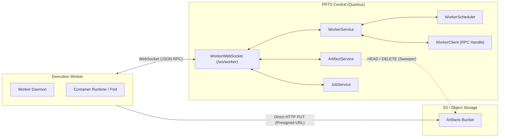
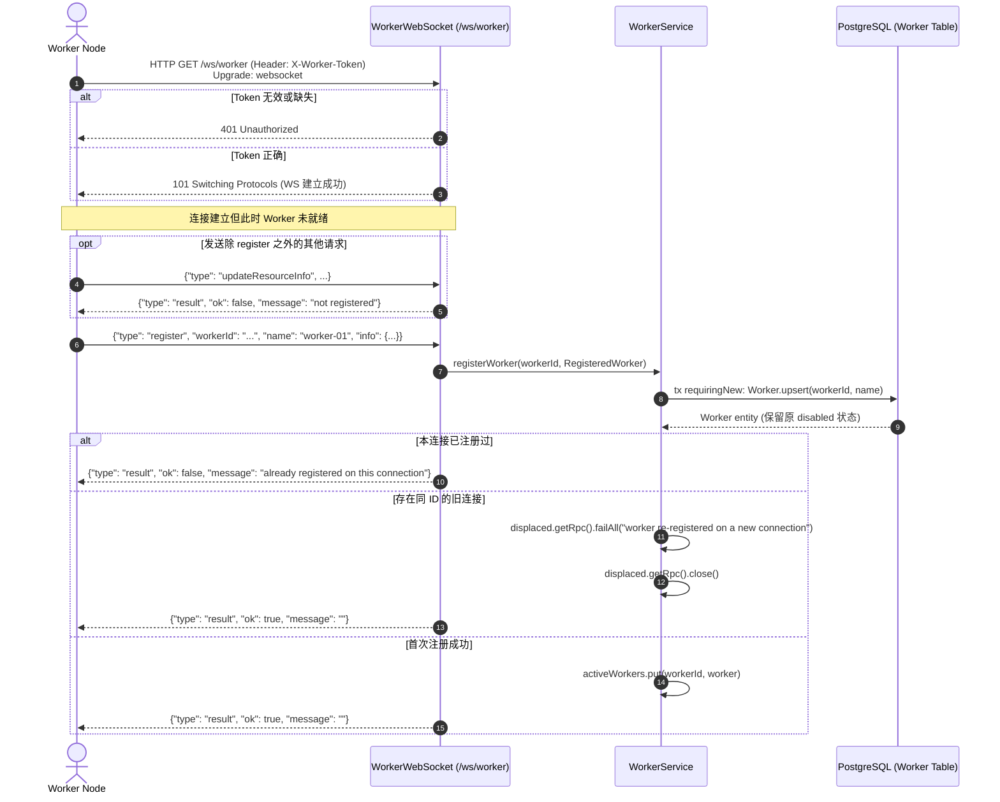
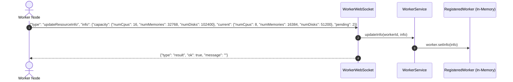
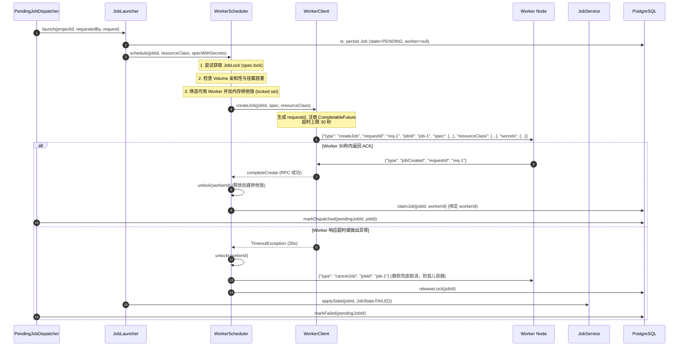
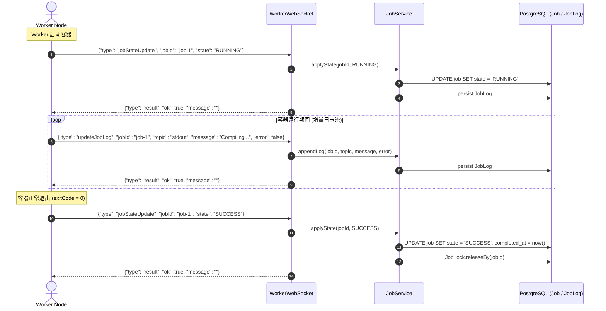
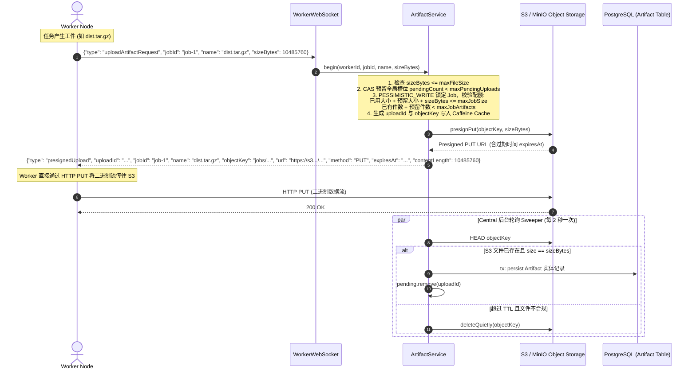
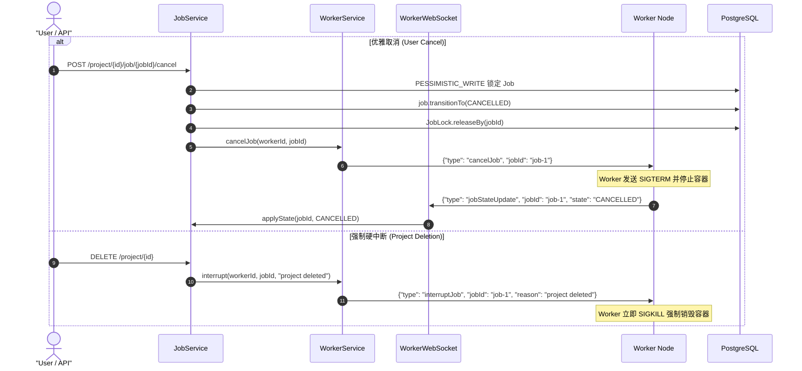
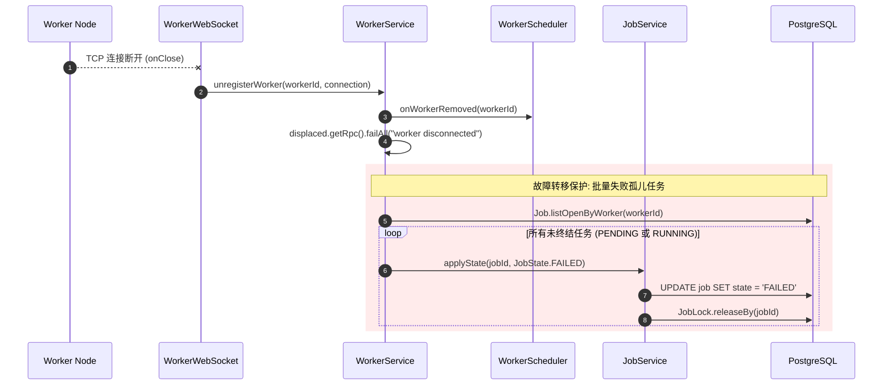
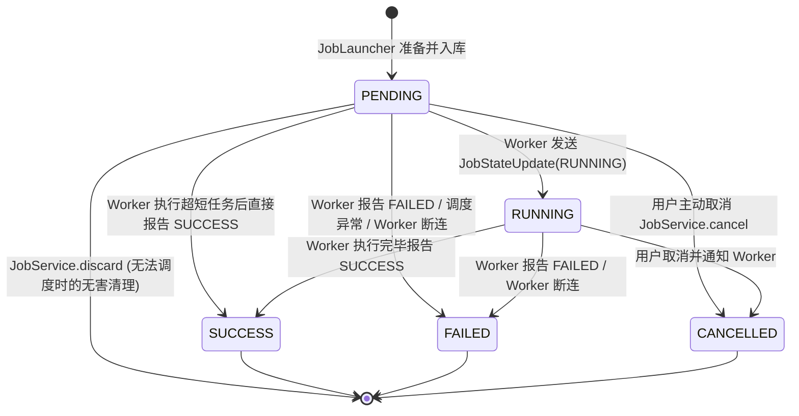
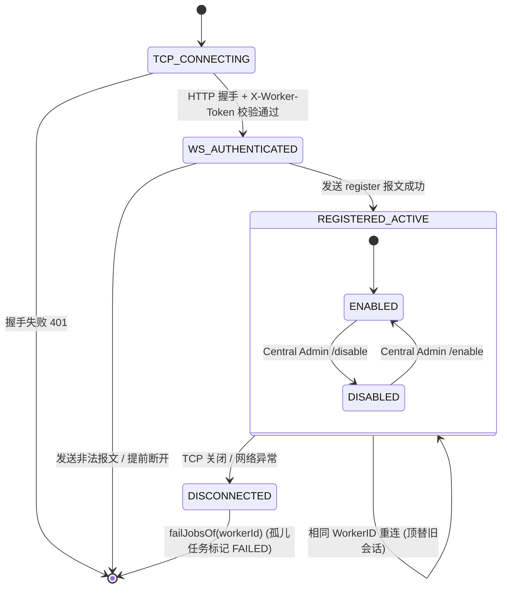

# PRTS Worker RPC 协议交互文档

本文档详细说明 PRTS Central（中心调度与管控面）与 Worker（任务执行节点）之间的全双工 RPC 通信协议规范，涵盖**报文格式**、**交互时序**、**状态转移**及**各端职责划分**。

---

## 1. 架构定位与通信层

PRTS 采用集中式调度、分布式执行架构：
- **PRTS Central（管控面）**：负责用户鉴权、任务排队、资源匹配、分布式锁管理、对象存储配额控制及最终状态汇总。
- **Worker（执行面）**：负责向 Central 注册与汇报资源、拉取并实例化任务容器、挂载本地持久卷、收集任务输出日志，以及将任务产物直传至对象存储。



### 1.1 传输通道与鉴权
- **通信端点**：`ws://<host>:<port>/ws/worker` 或 `wss://<host>:<port>/ws/worker`
- **底层协议**：WebSocket（文本帧 Text Frame，UTF-8 编码）
- **握手鉴权**：
  - 核心实现位于 [`WorkerAuthMechanism`](file:///home/icybear/IdeaProjects/prts-central/src/main/java/io/ib67/prts/auth/WorkerAuthMechanism.java)。
  - Worker 在发起 WebSocket 升级握手时，必须在 HTTP Header 中携带凭据：
    ```http
    X-Worker-Token: <WORKER_SHARED_SECRET>
    ```
  - Central 服务端比对该 Token 与配置项 [`WorkerConfig.secret`](file:///home/icybear/IdeaProjects/prts-central/src/main/java/io/ib67/prts/agent/worker/WorkerConfig.java)；若缺失、长度不一致或内容不匹配，服务端在 HTTP 握手阶段直接返回 `401 Unauthorized` 拒绝建立连接。
  - **重要原则**：WebSocket 连接建立成功**并不等于** Worker 注册成功。刚连接的连接仅具备合法身份，必须显式通过 RPC 发送 `register` 报文才能加入 Central 调度名单。

### 1.2 序列化与报文多态模型
所有上行（Serverbound）与下行（Clientbound）报文均使用 Jackson JSON 序列化，并通过顶层字段 `"type"` 声明具体的报文类型。

```json
{
  "type": "<message_type>",
  "...": "..."
}
```

---

## 2. RPC 报文全集定义

### 2.1 上行报文：ServerboundMessage（Worker -> Central）
定义在 [`ServerboundMessage.java`](file:///home/icybear/IdeaProjects/prts-central/src/main/java/io/ib67/prts/agent/worker/message/ServerboundMessage.java)：

| 类型 (`type`) | 对应 Record | 说明 | 关键字段 |
| :--- | :--- | :--- | :--- |
| `register` | [`Register`](file:///home/icybear/IdeaProjects/prts-central/src/main/java/io/ib67/prts/agent/worker/message/ServerboundMessage.java#L29) | Worker 节点向 Central 注册或重连宣布自身身份 | `workerId` (UUID), `name` (String), `info` ([`Info`](file:///home/icybear/IdeaProjects/prts-central/src/main/java/io/ib67/prts/agent/worker/RegisteredWorker.java#L34), 可空) |
| `updateResourceInfo` | [`UpdateResourceInfo`](file:///home/icybear/IdeaProjects/prts-central/src/main/java/io/ib67/prts/agent/worker/message/ServerboundMessage.java#L44) | Worker 周期性或状态变化时上报自身可用资源及排队量 | `info` ([`Info`](file:///home/icybear/IdeaProjects/prts-central/src/main/java/io/ib67/prts/agent/worker/RegisteredWorker.java#L34)) |
| `jobCreated` | [`JobCreated`](file:///home/icybear/IdeaProjects/prts-central/src/main/java/io/ib67/prts/agent/worker/message/ServerboundMessage.java#L53) | Worker 收到 Central 的 `createJob` 后返回的创建确认 ACK | `requestId` (UUID, 关联 Central 请求) |
| `jobStateUpdate` | [`JobStateUpdate`](file:///home/icybear/IdeaProjects/prts-central/src/main/java/io/ib67/prts/agent/worker/message/ServerboundMessage.java#L59) | Worker 上报作业执行状态转移（如 RUNNING、SUCCESS、FAILED 等） | `jobId` (UUID), `state` ([`JobState`](file:///home/icybear/IdeaProjects/prts-central/src/main/java/io/ib67/prts/project/entity/JobState.java)) |
| `updateJobLog` | [`UpdateJobLog`](file:///home/icybear/IdeaProjects/prts-central/src/main/java/io/ib67/prts/agent/worker/message/ServerboundMessage.java#L37) | Worker 流式增量回传作业日志输出 | `jobId` (UUID), `topic` (String), `message` (String), `error` (Boolean) |
| `uploadArtifactRequest` | [`UploadArtifactRequest`](file:///home/icybear/IdeaProjects/prts-central/src/main/java/io/ib67/prts/agent/worker/message/ServerboundMessage.java#L66) | Worker 请求直传生成的产物文件至对象存储 | `jobId` (UUID), `name` (String, 建议文件名), `sizeBytes` (long) |

### 2.2 下行报文：ClientboundMessage（Central -> Worker）
定义在 [`ClientboundMessage.java`](file:///home/icybear/IdeaProjects/prts-central/src/main/java/io/ib67/prts/agent/worker/message/ClientboundMessage.java)：

| 类型 (`type`) | 对应 Record | 说明 | 关键字段 |
| :--- | :--- | :--- | :--- |
| `result` | [`Response`](file:///home/icybear/IdeaProjects/prts-central/src/main/java/io/ib67/prts/agent/worker/message/ClientboundMessage.java#L26) | Central 对 Worker 请求的一般性同步响应结果 | `ok` (boolean), `message` (String, 错误原因或空) |
| `createJob` | [`CreateJob`](file:///home/icybear/IdeaProjects/prts-central/src/main/java/io/ib67/prts/agent/worker/message/ClientboundMessage.java#L38) | Central 指令 Worker 启动并执行指定作业 | `requestId` (UUID), `jobId` (UUID), `spec` ([`JobSpec`](file:///home/icybear/IdeaProjects/prts-central/src/main/java/io/ib67/prts/agent/job/JobSpec.java)), `resourceClass` ([`ResourceClass`](file:///home/icybear/IdeaProjects/prts-central/src/main/java/io/ib67/prts/agent/worker/entity/ResourceClass.java)), `secrets` (Map<String, String>) |
| `cancelJob` | [`CancelJob`](file:///home/icybear/IdeaProjects/prts-central/src/main/java/io/ib67/prts/agent/worker/message/ClientboundMessage.java#L55) | Central 请求 Worker 优雅取消指定作业 | `jobId` (UUID) |
| `interruptJob` | [`InterruptJob`](file:///home/icybear/IdeaProjects/prts-central/src/main/java/io/ib67/prts/agent/worker/message/ClientboundMessage.java#L62) | Central 强制指示 Worker 立即销毁并丢弃作业（如项目删除时） | `jobId` (UUID), `reason` (String) |
| `presignedUpload` | [`PresignedUpload`](file:///home/icybear/IdeaProjects/prts-central/src/main/java/io/ib67/prts/agent/worker/message/ClientboundMessage.java#L69) | Central 为 Worker 生成的 S3 预签名直传凭证 | `uploadId` (UUID), `jobId` (UUID), `name` (String), `objectKey` (String), `url` (String), `method` (String), `expiresAt` (Instant), `contentLength` (long) |

---

## 3. 核心交互时序图与交互协议

### 3.1 握手与注册时序（Registration Flow）



#### 关键约束
1. **未注册拦截**：在收到首个合法的 `register` 消息前，Central 拒绝处理该连接发送的任何其他报文（返回 `{"type": "result", "ok": false, "message": "not registered"}`）。
2. **幂等性与更名**：Worker 重连时若携带了新的 `name`，Central 在注册阶段自动在数据库中执行 `Worker.upsert` 更新节点名称。
3. **顶替旧会话**：若同一 `workerId` 发起新连接注册，Central 自动剔除旧会话，中断旧会话的待处理 RPC，确保内存中单 WorkerID 仅对应唯一的活跃会话。

---

### 3.2 节点资源上报与调度容量同步

Worker 应当在启动后、资源变动时或定期向 Central 报告其资源容量与待运行任务数。



Central 调度器利用上报的 `info` 执行两级过滤：
1. **容量校验（`capacityFits`）**：Worker 的 `capacity` 必须满足作业 `ResourceClass` 要求的 CPU、内存与磁盘。
2. **负载均衡指标（`pendingJobCount`）**：在所有满足条件的 Worker 中，优先选择 `pending` 数值最小的节点。

---

### 3.3 作业分发与确认 RPC 时序（Job Dispatch RPC）

Central 的 [`PendingJobDispatcher`](file:///home/icybear/IdeaProjects/prts-central/src/main/java/io/ib67/prts/pending/PendingJobDispatcher.java) 会在后台调度作业，经由 [`WorkerScheduler`](file:///home/icybear/IdeaProjects/prts-central/src/main/java/io/ib67/prts/agent/worker/WorkerScheduler.java) 派发到选定的 Worker。



#### 细节说明
- **解密密钥下发**：出于安全考虑，作业持久化的 `spec` 不存明文密钥；明文密钥仅在调度时由 [`JobLauncher`](file:///home/icybear/IdeaProjects/prts-central/src/main/java/io/ib67/prts/project/JobLauncher.java) 临时拼装到内存对象，通过 `createJob.secrets` 传输给 Worker。
- **并发创建锁（Transient Create Lock）**：在 Central 发起 `createJob` 到收到 `jobCreated` ACK 期间（最多 30s），WorkerID 会加入 `WorkerScheduler.locked` 集合，防止其他调度线程同一瞬间向同一个 Worker 堆叠创建作业。
- **异常自愈取消**：若 30s 内未收到 Worker ACK 或网络异常，Central 会立刻向 Worker 发送 `cancelJob`，防止 Worker 在超时后仍拉起容器造成孤儿资源泄漏。

---

### 3.4 作业执行、日志回传与终态更新

作业被 Worker 接收后，Worker 负责驱动容器生命周期，并回传日志和状态。



---

### 3.5 产物直传对象存储时序（Direct Artifact Upload）

为了避免 Central 成为大文件传输的带宽瓶颈，PRTS 采用 S3 预签名直传设计。



#### 产物上传核心保障
- **Worker 免鉴权访问 S3**：Worker 无需持有云存储的 AK/SK，仅持有 Central 颁发的单次有效预签名 PUT URL。
- **并发配额预占（Quota Reservation）**：Central 在发 URL 前就在内存 Cache 中为该上传预占了配额空间，防止并发上传打爆配额。
- **自动对齐与回收机制**：即使 Worker 忘记通知 Central 上传完毕，Central 的异步 Sweeper 也会周期性检查 S3 对象并自动落库（Promote）；若超时未上传或尺寸不符，Sweeper 会直接清理 S3 垃圾文件。

---

### 3.6 作业取消与强制中断时序

PRTS 区分两种停止作业的场景：
1. **优雅取消（`CancelJob`）**：用户主动取消，Worker 捕获信号并有权执行清理逻辑，最后回传 `JobStateUpdate(CANCELLED)`。
2. **强制中断（`InterruptJob`）**：通常发生于项目被删除等紧急情况，Central 直接指示 Worker 立即销毁并丢弃容器，Central 不再等待状态转移。



---

### 3.7 连接断开与故障转移清理时序（Failure Handling）

若 Worker 进程崩溃、机器宕机或网络中断，Central 负责触发自动兜底清理，避免作业永久悬挂。



---

## 4. 核心状态机与转移规则

### 4.1 作业生命周期状态机（`JobState`）

定义在 [`JobState.java`](file:///home/icybear/IdeaProjects/prts-central/src/main/java/io/ib67/prts/project/entity/JobState.java)：



#### 状态机不可逆约束（Terminal Invariance）
1. **终态锁定**：`SUCCESS`、`FAILED`、`CANCELLED` 属于终态（`state.isTerminal() == true`）。
2. **幂等忽略**：一旦 Job 进入终态，[`JobService.applyState`](file:///home/icybear/IdeaProjects/prts-central/src/main/java/io/ib67/prts/project/JobService.java#L120) 将直接忽略后续来自 Worker 的任何状态回传，防止延迟网络包污染数据库状态。
3. **完成时间同步**：当且仅当进入终态时，更新 `completed_at` 时间戳；非终态强制为 `null`（对应数据库强一致约束 `job_completion_consistency`）。
4. **排他锁自动释放**：只要进入任意终态，自动触发 `JobLock.releaseBy(jobId)`，唤醒后续等待同名锁的作业。

---

### 4.2 Worker 连接与会话状态转移



---

## 5. 责任划分矩阵（Responsibility Boundaries）

| 职能维度 | Central (服务端) 责任 | Worker (执行端) 责任 |
| :--- | :--- | :--- |
| **接入与鉴权** | 校验 `X-Worker-Token`；校验报文 JSON 结构与必填字段；拦截未注册会话。 | 在握手头中携带合法 Token；在连接成功后立即发送 `register` 报文。 |
| **拓扑与配置维护** | 持久化 Worker 元数据；缓存内存中活跃 Worker 列表及会话 RPC 句柄；支持禁用/启用。 | 自行分配并持久化全局唯一的 `workerId`（UUID）；上报节点名称。 |
| **资源与容量核算** | 根据 Worker 上报的 capacity 校验 `ResourceClass` 规格；检查本地 Volume 亲和性。 | 周期性、精准探测本机当前可用的 CPU、内存、磁盘，并计算待运行任务数上报。 |
| **作业调度与并发** | 管理排队队列；获取项目级互斥锁（`JobLock`）；按最少等待数选择节点；设置 30s 创建超时。 | 收到 `createJob` 后在 30s 内响应 `jobCreated` ACK；根据 spec 拉取镜像或预热环境。 |
| **安全与凭据管理** | 从项目安全存储中提取明文 Secrets，通过 RPC 发送给 Worker；严禁持久化明文 Secrets。 | 在容器内部注入环境变量；容器销毁后彻底抹除内存与磁盘中的 Secrets 痕迹。 |
| **作业执行与容器** | 不参与底层容器运行。 | 隔离管理容器生命周期；挂载本地持久卷；监控容器退出码并上报状态。 |
| **日志收集** | 提供高性能日志持久化接口（[`JobService.appendLog`](file:///home/icybear/IdeaProjects/prts-central/src/main/java/io/ib67/prts/project/JobService.java#L164)）。 | 捕获容器 stdout/stderr；按需切分消息并通过 `updateJobLog` 准实时回传。 |
| **工件产物传输** | 校验工件大小；管控单作业总量与全局并发上传数；颁发 S3 预签名 URL；异步检测并落库。 | 计算待上传工件的准确字节数，发起 `uploadArtifactRequest`；使用 HTTP PUT 直传 S3。 |
| **取消与异常中断** | 发起 `cancelJob` 或 `interruptJob`；在 Worker 异常离线时代其将所有未完成任务刷为 `FAILED`。 | 响应 `cancelJob` 触发优雅终止逻辑；响应 `interruptJob` 立即强制清理无用进程。 |
